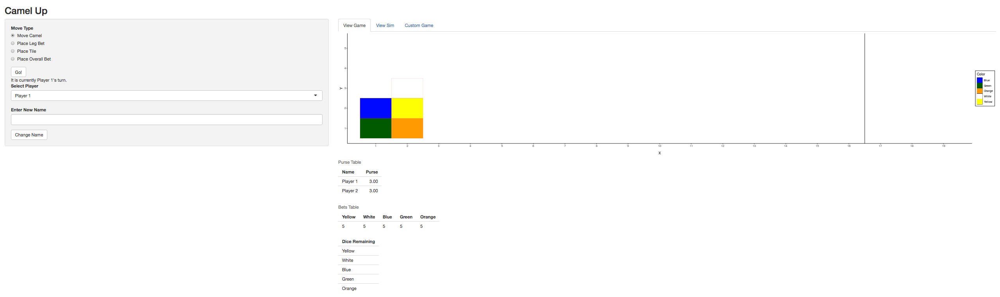
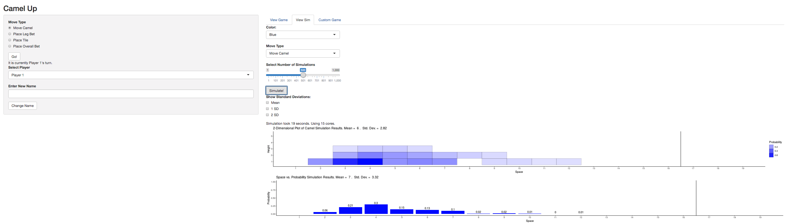

<!-- README.md is generated from README.Rmd. Please edit that file -->

# CamelUp

<!-- badges: start -->

[](https://travis-ci.org/mczekanski1/Camel-Up)
<!-- badges: end -->

The goal of camelUp is to implement the board game CamelUp and include
simulations to assist instruction in introductory statistics courses.

## Installation

You can install the released version of camelUp from
[CRAN](https://CRAN.R-project.org) with:

``` r
install.packages("camelUp")
```

And the development version from [GitHub](https://github.com/) with:

``` r
# install.packages("devtools")
devtools::install_github("mczekanski1/Camel-Up/camelUp")
```

## Example

The main function of this package is to allow the user to run this game
locally. We have exported all of the objects in case the user would like
to make use of them, but the main focus is on playing the game.

``` r
library(CamelUp)
#playCamelUp()
```

This will start a local shiny app with some of the functionality shown
below:

 
